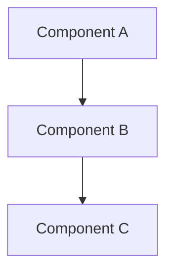

# Design Creation

This reference covers Phase 2 of spec-driven development: translating approved requirements into a technical design document that defines how the feature will be built.

---

## Prerequisites

- `REQUIREMENT.md` must exist and be approved by the user
- Read the requirements thoroughly before starting design
- Read `understanding-codebase` skill for project conventions

---

## Codebase Research

Before writing any design, explore the existing codebase:

1. **Existing modules** — What modules exist in `apps/api/src/modules/`? Which ones does this feature touch?
2. **Existing patterns** — How do similar features handle data models, API endpoints, UI components?
3. **Integration points** — What existing services, schemas, or components will this feature depend on?
4. **Shared schemas** — What already exists in `packages/shared/src/schemas/`?

Use this research to inform the design. Do NOT create separate research files — use findings as context embedded in the design doc.

---

## Consulting the Technical Architect

For features that involve architectural decisions (new data models, queue pipelines, cross-module interactions), invoke the `technical-architect` subagent:

```
Task(
  subagent_type: "technical-architect",
  readonly: true,
  description: "Design {feature name}",
  prompt: "The user wants to build: {feature description}.
           Requirements are in specs/{feature-name}/requirement/REQUIREMENT.md.
           Please produce a technical design with architecture, data models,
           API contracts, component structure, and integration points."
)
```

Use the architect's output as the foundation for `DESIGN.md`. You may reorganize, add detail, or split into resource files.

---

## DESIGN.md Structure

Create `specs/{feature-name}/design/DESIGN.md`:

```markdown
---
status: draft
last-verified: YYYY-MM-DD
---

# Design: {Feature Name}

## Overview

[High-level description of the solution approach.
What problem are we solving and how? 2-3 sentences.]

## Architecture

[How this feature fits into the existing system.
Which existing modules it integrates with.]



## Data Models

[Mongoose schemas, Zod schemas, key TypeScript interfaces.
Include field names, types, indexes, and relationships.]

## API Endpoints

[Endpoint paths, HTTP methods, request/response shapes,
auth requirements, permission guards.]

| Method | Path | Auth | Permission | Description |
|--------|------|------|------------|-------------|
| POST | /api/examples | JWT | EXAMPLE_CREATE | Create example |
| GET | /api/examples | JWT | EXAMPLE_VIEW | List examples |

## Component Design

[Frontend components, page structure, state management approach.
Include component hierarchy and key props/state.]

## Error Handling

[Error cases and handling strategies.]

| Error Case | Handling Strategy |
|------------|-------------------|
| Network failure | Retry with exponential backoff |
| Invalid input | Show validation message |

## Testing Strategy

[How the feature will be tested.]

- Unit tests for: [specific services, utilities]
- Integration tests for: [specific flows]
- E2E considerations: [if applicable]

## Deviations

[This section starts empty. Populated during execution when
implementation diverges from this design.]
```

---

## When to Split Into Resources

Create `design/resources/` when the feature has **3+ distinct technical subsystems** that each need detailed design. The main `DESIGN.md` stays as an architecture overview, and each resource file covers one subsystem.

**Split by technical subsystem**, not by user role:

| Good Split (by subsystem) | Bad Split (by role) |
|---------------------------|---------------------|
| `data-models.md` | `teacher-features.md` |
| `evaluation-queue.md` | `student-features.md` |
| `student-exam-ui.md` | `admin-features.md` |
| `exam-api-endpoints.md` | |

Each resource file covers architecture, interfaces, data flow, and error handling for its subsystem. The main `DESIGN.md` links to them:

```markdown
## Detailed Design

For subsystem-level design, see:
- [Data Models](resources/data-models.md)
- [Evaluation Queue](resources/evaluation-queue.md)
- [Student Exam UI](resources/student-exam-ui.md)
```

---

## Design Quality Checklist

Before presenting to user, verify:

- [ ] Every requirement from `REQUIREMENT.md` is addressed
- [ ] Architecture diagram included (Mermaid preferred)
- [ ] Data models defined with field names, types, indexes
- [ ] API contracts defined with paths, methods, DTOs
- [ ] Design follows existing codebase patterns (controller → service → repository, TanStack Router, etc.)
- [ ] Permission model defined (which permissions, which guards)
- [ ] Error cases identified with handling strategies
- [ ] `## Deviations` section exists (empty for now)

---

## Review Gate

After creating or updating design:

1. Present the design to the user (highlight key architectural decisions, not every detail)
2. Call out any tradeoffs or alternatives you considered
3. Ask: **"Does the design look good? Any changes before we create the task list?"**
4. If user requests changes → make them, present again
5. If user identifies requirement gaps → redirect to spec-update workflow for requirement changes first
6. If user approves → update frontmatter `status: draft` to `status: in-progress`, proceed to task creation

**Do NOT proceed to tasks without explicit approval.**
