# tstack Starter Kit — ER Diagram

## Collections

7 core collections: `users`, `organizations`, `memberships`, `roles`, `permissions`, `invitations`, `system_settings`

```mermaid
erDiagram
    User {
        ObjectId _id PK
        string email UK "unique, lowercase"
        string passwordHash "Argon2"
        string firstName
        string lastName
        string phone "optional"
        string status "active | inactive"
        string[] roleNames "platform-level roles"
        string[] directPermissions "platform grants"
        string[] revokedPermissions "platform revocations"
        ObjectId currentOrgId FK "active org context"
        string refreshTokenHash "optional"
        Date refreshTokenExpiresAt "optional"
        string resetPasswordTokenHash "optional"
        Date resetPasswordTokenExpiresAt "optional"
        Date createdAt
        Date updatedAt
    }

    Organization {
        ObjectId _id PK
        string name
        string slug UK "subdomain e.g. acme"
        ObjectId ownerId FK "creator/owner"
        string contactEmail
        string contactPhone "optional"
        string address "optional"
        string status "active | suspended | inactive"
        boolean isPersonal "auto-created on signup"
        string logoUrl "optional"
        string logoKey "optional"
        Date createdAt
        Date updatedAt
    }

    Membership {
        ObjectId _id PK
        ObjectId userId FK
        ObjectId orgId FK
        string[] roleNames "per-org roles"
        string[] directPermissions "per-org grants"
        string[] revokedPermissions "per-org revocations"
        string status "active | inactive"
        Date createdAt
        Date updatedAt
    }

    Role {
        ObjectId _id PK
        string name UK
        string description
        string[] permissionNames "e.g. products.create"
        boolean isDefault "system roles, cant delete"
        Date createdAt
        Date updatedAt
    }

    Permission {
        ObjectId _id PK
        string name UK "e.g. products.create"
        string description
        string group "e.g. products"
        Date createdAt
        Date updatedAt
    }

    Invitation {
        ObjectId _id PK
        ObjectId orgId FK
        string email
        string roleName "role assigned on accept"
        ObjectId invitedBy FK
        string tokenHash "signed URL token"
        Date expiresAt
        Date createdAt
        Date updatedAt
    }

    SystemSetting {
        ObjectId _id PK
        string key UK "e.g. allowSignup, maintenanceMode"
        Mixed value
        Date createdAt
        Date updatedAt
    }

    User ||--o{ Organization : "owns"
    User ||--o{ Membership : "belongs to orgs"
    Organization ||--o{ Membership : "has members"
    Organization ||--o{ Invitation : "pending invites"
    User ||--o{ Invitation : "invited by"
    User }o--|| Organization : "currentOrgId (active context)"
    Role ||--o{ Permission : "permissionNames references"
```



## Relationships

- `User` 1:N `Organization` (owner)
- `User` 1:N `Membership` (belongs to many orgs)
- `Organization` 1:N `Membership` (has many members)
- `Organization` 1:N `Invitation` (pending invites)
- `User.currentOrgId` → `Organization` (active context, switchable)
- `Role.permissionNames` → `Permission.name` (logical FK)
- `User.roleNames` → `Role.name` (platform-level)
- `Membership.roleNames` → `Role.name` (tenant-level)

## Permission Resolution

```
Platform:  User.roleNames → expand via Role.permissionNames
           + User.directPermissions
           - User.revokedPermissions
           = platformPermissions

Tenant:    Membership.roleNames → expand via Role.permissionNames
           + Membership.directPermissions
           - Membership.revokedPermissions
           = tenantPermissions

JWT:       platformPermissions UNION tenantPermissions
           (for User.currentOrgId)
```

## Multi-Org Flow

1. User signs up → personal Organization auto-created, Membership with "Owner" role
2. User creates another org → new Organization + Membership (Owner)
3. User invited to org → Invitation created → on accept: Membership created with invited role
4. User switches org → `currentOrgId` updated → new JWT issued with that org's permissions
5. All API queries scoped by `orgId` via `BaseRepository`

## Domain Entities (added by user after fork)

Every domain entity follows this pattern:
```
Entity {
    ObjectId _id PK
    string orgId FK "auto-scoped by BaseRepository"
    ...domain fields
    Date createdAt
    Date updatedAt
}
```
